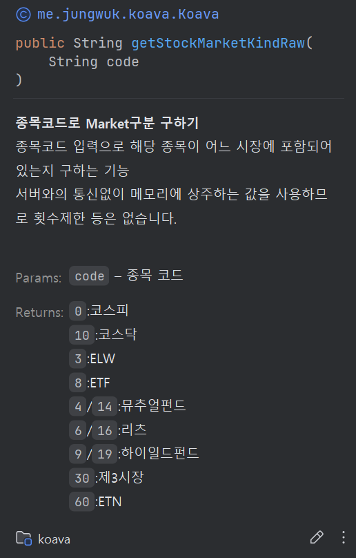

  
[](https://hits.seeyoufarm.com)  

# Koava
Koava는 Java 환경에서 키움증권의 Open API를 효율적으로 활용할 수 있도록 설계된 라이브러리입니다.  
이 라이브러리는 smok95님의 [kw_](https://github.com/smok95/kw_) 리포지토리에 기반한 DLL을 활용하여 동작하며, 개발자의 개발 편의성 개선을 목표로 하고 있습니다.  
개선이 필요한 부분이 존재할 수 있으나, 피드백을 통해 지속적인 개선이 이루어질 예정입니다.

## 요구 사항
- ``java 8 (32bit)``  
- ``키움증권 Open API``    
**참고: 키움증권의 Open API는 32비트 Java만을 지원하므로 반드시 Java 8 (32bit) 환경을 구성해야 합니다.**

## 주의 사항
- 현재 개발 초기 단계에 있으며, 충분한 테스트가 이루어지지 않았습니다.
- 반드시 모의 투자 모드로 로그인하여 모든 기능을 충분히 테스트한 후 사용하시기 바랍니다.
- API가 빈번히 변경될 수 있습니다.
- 키움 Open API는 기본적으로 스레드를 지원하지 않습니다. 스레드를 활용하실 예정이시면, 주의해서 개발하셔야 합니다. 

## 키움증권 Open api 사용법
- https://github.com/me2nuk/stockOpenAPI?tab=readme-ov-file
- [kw_ 리포지토리](https://github.com/smok95/kw_)
- [Kiwoom Open API Plus Dev Guide](https://download.kiwoom.com/web/openapi/kiwoom_openapi_plus_devguide_ver_1.5.pdf)

## 설치 및 설정

### 1. Koava 설치
이 리포지토리를 클론한 후, maven install해주세요.   
이후, 사용하실 프로젝트의 'pom.xml'에 아래와 같이 의존성을 추가하세요.
```xml
        <dependency>
            <groupId>me.jungwuk.koava</groupId>
            <artifactId>koava</artifactId>
            <version>1.0-SNAPSHOT</version>
        </dependency>
```

### 2. Koava 초기화 및 로그인
```java
Koava k = Koava.getInstance();
k.init(); // 초기화

// 로그인 이벤트 콜백 설정
k.setOnEventConnect(data -> {
    KoaCode code = data.errCode;

    if (!code.isError()) {
        System.out.println("로그인 성공");
    } else {
        System.out.println("오류 발생 : " + code.getErrorMessage());
        System.out.println(code);
        k.disconnect();
    }
});

// 로그인 창 실행
KoaCode code = k.commConnect();
if (code.isError()) {
    System.out.println("로그인 창을 열지 못했습니다! " + code.getErrorMessage());
    Runtime.getRuntime().exit(1);
}  

// 종료 대기 (k.disconnect();가 실행될 때까지 대기합니다.)
k.waitDisconnection();
```

## 주요 기능
### 다중 이벤트 핸들러 지원
Koava는 하나의 이벤트에 대해 여러 개의 핸들러를 등록할 수 있는 유연한 이벤트 처리 구조를 제공합니다. 이를 통해 다양한 시나리오에 맞는 동적인 이벤트 처리와 역할 분리가 가능합니다.
```java
// 여러개의 이벤트 핸들러 등록 가능
k.addEventHandler(new MyEventHandler()); // 급등주모니터링
k.addEventHandler(new MyEventHandler2()); // 조건에_맞는_특정_테마주_매매
```  

각 핸들러는 KoaEventHandler 클래스를 상속하여 구현하며, 원하는 이벤트 메서드를 오버라이드하여 처리합니다.

```java
public class MyEventHandler2 extends KoaEventHandler {
    @Override
    public void onEventConnect(Koava koava) {
        System.out.println("핸들러 2에서 로그인 이벤트를 받음");
    }

    @Override
    public void onReceiveRealData(RealData data) {
        if (data.realType.equals("주식체결")) {
            System.out.println("종목 코드 : " + data.realKey);
            System.out.println("데이터 : " + data.realData);
            
            System.out.println("현재가 : " + RealTypes.주식체결.현재가.get());
            // koava.getCommRealData(realKey, 10);으로도 가져올 수 있어요
        }
    }

    @Override
    public void onReceiveMsg(MsgData data) {
        System.out.println("받은 메시지 : " + data.msg);
    }
}
```

### 상황에 따라 모듈처럼 동적으로 콜백 활성화 & 비활성화
동적으로 핸들러를 추가하고 제거할 수 있습니다.   
```
void 몇_분마다_실행되는_메소드() {
    if (now == 오전) {
        koava.addHandler(this.오전장이벤트핸들러());
        koava.removeHandelr(this.오후장이벤트핸들러());
    } else {
        koava.addHandler(this.오후장이벤트핸들러());
        koava.removeHandelr(this.오전장이벤트핸들러());    
    }
}
```

**참고** : 이벤트 핸들러는 추가된 순서대로 하나씩 실행됩니다.

### Waiter  
Waiter를 이용하면 순차적인 로직을 아래처럼 쉽게 구현할 수 있습니다.  
``로그인 -> 삼성전자 현재가 10만원까지 기다리기 -> 삼성전자 매수``  
```java
        /**
        * 로그인 대기
        */
        EventConnectWaiter loginWaiter = new EventConnectWaiter();
        loginWaiter.waitEvent(); // 로그인 대기
        KoaCode result = loginWaiter.getData().errCode;

        System.out.println("로그인 성공 여부 : " + (result.isError() ? "실패" : "성공"));
        if (result.isError()) return;

        /**
         * 특정 가격 체결 기다리기
         */
        koava.setInputValue("종목코드",  "005930");
        koava.commRqData( "RQName", "OPT10003",0,  "1000");

        // 필요한 FID 목록
        RealTypes.FID[] fidArr = new RealTypes.FID[]{RealTypes.FID.현재가};
        // 10만원 이상일 때
        WaiterFilter<RealData> filter = realData -> Integer.parseInt(RealTypes.FID.현재가.get()) >= 100000;

        RealDataWaiter rdWaiter = new RealDataWaiter(fidArr, filter);
        rdWaiter.waitEvent(); // 10만원 이상일 때까지 기다림

        String currentPrice = rdWaiter.getFidData(RealTypes.FID.현재가); // 이럴땐 getFidData를 사용해서 받아와야합니다.
        System.out.println("현재가 : " + currentPrice);

        /**
         * 신규 매수
         */
        String accNo = koava.getAccountNoList().get(0); // 계좌번호
        // 신규 매수, 10주, 시장가
        koava.sendOrder("order", "1000", accNo, OrderType.NEW_BUY, "005930", 10, 0, HogaType.MARKET, "");
```  

#### **⚠️주의**  
실시간 데이터에서 FID의 값을 가져올 때는 ``RealDataWaiter``생성시 필요한 FID 목록(배열)을 넣고, 데이터가 필요한 때에 ``RealDataWaiter.getFidData()``를 사용하여 데이터를 얻어야합니다.  
키움증권 API의 ``getCommRealData``는 ``OnReceiveRealData`` 안에서 실행되어야하지만, Waiter를 사용하면 그렇게 할 수 없습니다. 때문에 Koava는 OnReceiveRealData 안에서 미리 요청된 FID에 해당하는 데이터를 받아옵니다.  

### KW_ 라이브러리 직접 사용
Koava 초기화 후, ``getKw()`` 메소드 호출로 KwLibrary 인스턴스를 받을 수 있습니다.  
이 경우 메모리 관리를 직접 해주어야 하므로 주의가 필요합니다.  
```java
KwLibrary lib = koava.getKw();
lib.kw_GetLoginInfoW(WString);
```

### 편리한 FID 관리
FID를 한글로 가져올 수 있습니다.  

```java
RealTypes.FID.현재가 // enum FID는 모든 FID를 가지고 있습니다.
```  
  
RealTypes는 KOA Studio에서 확인할 수 있는 실시간 타입들이 있습니다. 해당 타입에서 사용할 수 있는 FID를 정리해두었습니다.
```java
RealTypes.주식체결.현재가 // 실시간 타입에 맞는 FID
```  
물론, 한글 사용이 불편하신 분들은 이렇게도 FID를 가져올 수 있습니다.  
```java
RealTypes.getFid(20);
```  
그리고, FID를 인자로 받는 모든 API 메소드는 int값도 허용합니다.  
```java
RealTypes.FID fid = RealTypes.FID.현재가;
koava.getCommRealData(realKey, fid);

// 또는
koava.getCommRealData(realKey, 10);
```

### FID 값 받아오기  

getCommRealData를 호출해도 되지만, 이런 쉬운 방법도 있습니다.
```java
RealTypes.주식체결.현재가.get();
// 또는
RealTypes.FID.현재가.get();
// 또는
RealTypes.getFid(10).get();
```

---
  
```java
k.setRealReg("1000", "005930;000660", new RealTypes.FID[] {RealTypes.FID.현재가}, RealRegistOption.CLEAR);
// 위 코드는 아래 코드들과 동일합니다.
                
k.setRealReg("1000", "005930;000660", new RealTypes.FID[] {RealTypes.getFid(10)}, RealRegistOption.CLEAR);

k.setRealReg("1000", "005930;000660", RealTypes.FID.현재가, RealRegistOption.CLEAR);
k.setRealReg("1000", "005930;000660", RealTypes.getFid(10), RealRegistOption.CLEAR);

k.setRealReg("1000", "005930;000660", "10", RealRegistOption.CLEAR);

// 여러 fid를 String으로 넣는 방법
k.setRealReg("1000", "005930;000660", "10;20", RealRegistOption.CLEAR);

```
조금 더 편리하게 개발하실 수 있도록 메소드에 다양한 파라미터를 넣을 수 있도록 해두었습니다.  

## Javadoc 및 추가 문서
  
- Javadoc: 코드 내에서 제공되는 다양한 메서드와 클래스에 대한 문서화가 진행 중입니다.

## 추가적인 사용법
```java
if (getStockMarketKind("000000") == MarketKind.KOSPI) {
    System.out.println("코스피");
}
```
Koava는 API 응답 데이터를 가공한 다음 제공합니다. 덕분에 개발 생산성을 높일 수 있습니다.    
만약, 가공되지 않은 데이터를 원한다면 메소드 명에 "Raw"를 붙이거나 KwLibrary 인스턴스로 직접 API를 요청할 수 있습니다..  
ex: ``getStockMarketKind`` -> ``getStockMarketKindRaw``

## 추가 예제


더 많은 사용 예제와 코드는 [여기](./example/)에서 확인할 수 있습니다. 앞으로도 예제는 지속적으로 추가될 예정입니다.

## 기여 방법
Koava는 오픈 소스 프로젝트로, 누구나 자유롭게 기여할 수 있습니다. 별도의 규칙은 없으니 자유롭게 Pull Request를 제출해 주세요.

## 질문
이슈에 남겨주시면 감사하겠습니다.